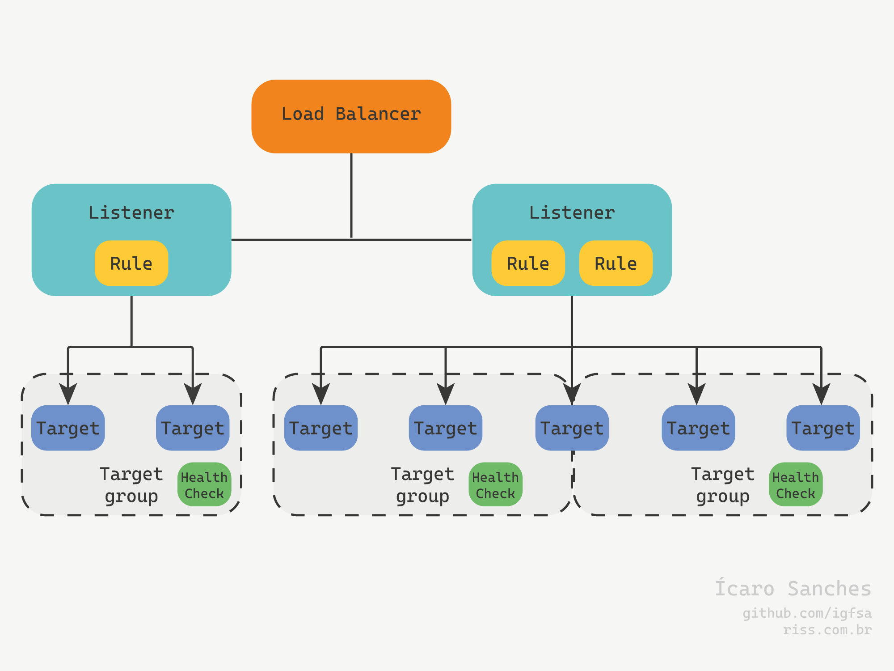

# Amazon Elastic Compute Cloud (Amazon EC2) #

https://aws.amazon.com/pt/ec2/

&xrArr; As instâncias EC2 são instâncias redimensionáveis de infraestrutura computacional. Funcionam como servidores computacionais. 

São 6 grupos, com diferentes objetivos de desempenho.

## Tipos de instâncias atuais de sexta geração (2024) ##

* Uso geral (Recursos balanceados, carga de RAM e CPU balanceadas e medianas): 

    M6a, M6g, M6gd, M6i, M6id, M6idn, M6in, M7a, M7g, M7gd, M7i, M7i-flex e T4g

* Otimizadas para computação (Maior uso de CPU, foco no processamento de dados): 

    C6a, C6g, C6gd, C6gn, C6i, C6id, C6in, C7a, C7g, C7gd, C7gn, C7i

* Otimizadas para memória (Maior uso de RAM): 
  
    R6a, R6g, R6gd, R6i, R6id, R6idn, R6in, R7a, R7g, R7gd, R7i, R7iz, X2gd, X2idn, X2iedn

* Otimizadas para armazenamento (Uso para bases de dados): 

    I4g, I4i, Im4gn, Is4gen

* Computação acelerada: 
    DL2q, G5g, Inf2, P5, Trn1, Trn1n

* Computação de alta performance: 
    Hpc6a, Hpc6id, Hpc7a, Hpc7g

https://docs.aws.amazon.com/pt_br/AWSEC2/latest/UserGuide/instance-types.html

&xrArr; No console web é possível ver todos os tipos e suas características, bem como filtrar de acordo com o desejado.

Serviços &rarr;  Computação &rarr; EC2 &rarr;  Instâncias &rarr; Tipos de instâncias

---

## Modalidades de contrato ##

&xrArr; O contrato por instâncias EC2 podem ser de 3 tipos.

_O armazenamento é sempre cobrado a parte, inclusive quando não está ocorrendo uso._

* On-Demand (padrão, todos cálculos de economia são feitos usando este método como base):

    Cobrado apenas o uso, ou seja, caso a máquina esteja desligada, não ocorrerão cobranças. A cobrança é feita por hora. Cada hora parcial é cobrada por segundo (a partir de 60 em máquinas linux) ou a hora completa para as demais.

* Reservadas:

    Pode ser feita de 3 formas, Padrão, que não permite alteração e possibilita até 72% de economia, Conversíveis, que permite alterações e até 54% de economia e Programadas, que permite realizar reservas por um curto de período de tempo. 

    Pagamento NoUpfront (sem pagamento no início de uso, faturamento mensal), Partitial Upfront (parte do pagamento no início) e Full Upfront (Pagamento total no início). 

    Contrato de 1 a 3 anos e não cancelável. A cobrança é feita independente do uso.

* Spot:

    Descontos de até 90%, porém pode ser interrompida a qualquer momento. A AWS informa 2 minutos antes da interrupção. Recomendada para aplicações tolerante a falhas, ambientes de testes e outros. Na contratação o valor máximo para pagamento pode ser definido e podem ser definidas instâncias por determinadas cargas de trabalho.

Calculadora de custos: https://calculator.aws/#/

* Savings Plan:

    Além dos faturamentos indicados, o Savings Plan é um modelo de preços flexíveis que oferece preços até 72% mais baixos em troca de um compromisso mensal de uso mínimo específico por um período de 1 a 3 anos. 

    Atende o serviço EC2 individualmente ou em com conjunto com o AWS Fargate e AWS Lambda (pacote Compute Savings Plan) e individualmente o serviço Amazon SageMaker (pacote Machine Learning Savings Plan). 

    Para usar é necessário habilitar o serviço Cost Explorer, um serviço que monitora e faz previsões de gastos, indicando formas otimizadas de uso dos serviços. Para seu funcionamento é necessário atentar que ele precisa de uma base para cálculo, portanto, o uso dos serviços já precisa ocorrer há um tempo. 

    Com o aumento da utilização, é possível contratar Planos de Poupança adicionais, aumentando o recurso disponível. 

    Os planos Compute e EC2 Instance se aplicam a instâncias que fazem parte dos clusters da Amazon EMR, EKS e ECS, porém cobrem apenas as instâncias EC2 são cobertas pelo plano.

---

## Iniciando uma instância ##

&xrArr; A inicialização de uma instância pode ser feita no console web. Serviços &rarr; EC2 &rarr; Instâncias &rarr; Instâncias &rarr; Executar instâncias.

&xrArr; É necessário selecionar uma imagem da AWS (AMI) para a máquina, o tipo de instância, criar um par de chaves (login, que deve ser baixado e armazenado para acesso), gerenciar informações de rede e armazenamento dentre outros. 

&xrArr; Este processo também pode ser feito via terminal.

`$ aws ec2 run-instances --image-id ami-xxxx --count 1 --instance-type 'tipo_instancia' --key-name 'nome_par_chave' --security-group-ids sg-xxxx --subnet-id subnet-xxxx`

Os valores de security-group-ids e subnet-id podem ser encontrados respectivamente em EC2 &rarr; Rede e Segurança &rarr; Grupos de Segurança e VPC &rarr; Nuvem Privada Virtual &rarr; Sub-redes.

&xrArr; Para acessar a instância é necessário utilizar o endereço público da máquina e adicionar o agente ssh (utilizando o arquivo de par de chaves baixado anteriormente). É necessário alterar a permissão do arquivo para privada, uma vez que sem esse procedimento todos acessos e usuários da máquina possuem permissão para o arquivo. O usuário a ser utilizado para acessar a máquina é o usuário ec2-user

`$ sudo chmod 400 'arquivo_chave_par'`

&xrArr; Após a alteração das permissões do arquivo, é possível se conectar a instância via terminal de uma máquina local.

`$ ssh -i 'arquivo_chave_par' ec2-user@ip_publico`

Após a criação é possível nomear a instância.

`$ aws ec2 create-tags --resources 'id_instancia' --tags Key=Name,Value=´nome´`

&xrArr; Para listar as instâncias:

`aws ec2 describe-instances`

---

## Desligamento e Encerramento - Shutdown Behavior, Stop Protection e Terminate Protection ##

&xrArr; Ao finalizar o uso de uma máquina criada ela pode ser interrompida ou encerrada. A máquina encerrada não pode ser utilizada novamente e tem os dados excluídos. Já a máquina interrompida pode ser reiniciada.

&xrArr; Na configuração de uma máquina é possível editar o comportamento no desligamento da máquina com a opção Shutdown Behavior, que define se a máquina irá interromper (stop) ou encerrar (terminate). 

&xrArr; Também é possível habilitar a proteção contra interrupção (Stop Protection), assim não é possível desligar a máquina no terminal. 

&xrArr; Outra proteção existente é a proteção contra encerramento (Termination Protection). 

&xrArr; Todas configurações podem ser feitas na criação da máquina e editadas na janela de ações da máquina. 

&xrArr; Os três recursos atuam no console web, porém caso a máquina esteja com o comportamento de encerrar no desligamento, ao desligar a máquina no terminal de uma máquina ligada a máquina virtual, a máquina ira encerrar e não poderá ser utilizada novamente. Portanto é ideal marcar a proteção contra encerramento e deixar o comportamento no desligamento como interromper. 

&xrArr; É possível remover instâncias via AWS CLI.

`$ aws ec2 terminate-instances --instance-ids 'id_instancia'`

&xrArr; **Para encerrar uma instância é necessário que a proteção contra encerramento e contra interrupção (desligamento) estejam desativadas.**

&xrArr; As operações de alterar proteção contra encerramento e interrupção podem ser feita via terminal. 

* Ativar proteção contra interrupção 
 
  `aws ec2 modify-instance-attribute --instance-id i-xxxxxxxxx --disable-api-stop`

* Desativar proteção contra interrupção 
  
  `aws ec2 modify-instance-attribute --instance-id i-xxxxxxxxx --no-disable-api-stop`

* Ativar proteção contra encerramento 
  
  `aws ec2 modify-instance-attribute --instance-id i-xxxxxxxxx --disable-api-termination `

* Desativar proteção contra encerramento 
  
  `aws ec2 modify-instance-attribute --instance-id i-xxxxxxxxx --no-disable-api-termination `

---

## AMIs - Criação e compartilhamento ##

&xrArr; Além das imagens de sistemas operacionais já disponibilizadas pela AWS ou disponíveis no Marketplace, também é possível criar imagem de uma máquina feita pelo usuário. 

&xrArr; O processo é feito com a criação de uma instância normal, porém como já se espera que alguns recursos da máquina estejam pré-configurados de acordo com a personalização do usuário, podem ser inseridos comandos para inicialização da máquina através do campo Dados do Usuário no item de Detalhes Avançados. 

Os comandos acima indicam o terminal bash para executar os códigos que realizam a atualização do sistema e instalam e executam o servidor Apache (httpd). Para funcionamento é necessário que o Grupo de Segurança esteja configurado para HTTP na Regra de Entrada através da porta 80. (EC2 &rarr; Grupos de Segurança). Após início da máquina com o servidor é possível testar digitando o endereço IP em um browser ou acessando a máquina via SSH no terminal e executar comandos para verificar a instalação e execução do serviço (necessário sudo). 

`$ rpm -qa | grep httpd`

`$ systemctl status httpd`

&xrArr; Uma vez com a máquina criada com a configuração desejada, é possível criar a imagem no menu de ações da instância. Ações &rarr; Imagens e modelos &rarr; Criar imagem. Na tela de criação de imagem existe uma flag de não reinicialização. Máquinas criadas com imagens que reinicializam (flag desmarcada) iniciam mais rápido.

&xrArr; Após a criação é possível visualizar a AMI criada. EC2 &rarr; Imagens &rarr; AMIs.

&xrArr; Ao localizar a AMI e selecioná-la, basta marcar a opção de executar instância dessa imagem. Também é possível informar a imagem desejada no processo comum de instância. 

## Criação de AMIs com o AWS CLI ##

&xrArr; Também é possível criar AMIs utilizando o AWS CLI

`$ aws ec2 create-image --instance-id "i-xxxxxx" --name "nome_imagem" --description "Descrição"`

No campo instance-id é passado o id da instância que servirá de base para a imagem.

&xrArr; Com a imagem criada, uma instância para aplicação da imagem pode ser criada normalmente, apenas com o id de imagem criado sendo passado como parâmetro.

## EC2 Image Builder ##

&xrArr; Este recurso é um Serviço da AWS totalmente gerenciado que ajuda a automatizar a criação, o gerenciamento e a implantação de imagens de servidor personalizadas, seguras e atualizadas. Então este recurso permite automatizar a criação de uma AMI já com todos processos de configuração, infraestrutura, distribuição e agenda sendo definidos em sua construção para serem realizados automaticamente. 

&xrArr; O acesso pode ser feito através da barra de pesquisa do console web ou através da tela de AMIs (EC2 &rarr; Imagens &rarr; AMIs), onde no canto superior direito é mostrado um link para o recurso.

&xrArr; A atuação ocorre através de um recurso conhecido como Golden Imagens, que é uma imagem referência gerada no processo e é a qual será posteriormente trabalhada. Inicialmente é necessário criar uma receita, que é um recurso onde devem ser informadas as características de configuração da máquina

&xrArr; Para utilizar esse recurso deve ser criada uma pipeline de 3 passos, a criação de uma Receita (Recipe), Definição de Configuração de Infraestrutura e Definição de Configuração de Distribuição. O segundo e o terceiro passos são opcionais.

&xrArr; Na Criação de Receita deve ser indicado o nome da Imagem, o S.O. a ser utilizado e a Imagem base para criação da instância. Configurações de acesso já podem ser inseridas neste passo também. Os Componentes, que são scripts de software que definem uma sequência de etapas para fazer download, instalar e configurar pacotes de software também devem ser especificados neste momento. Validações desses componentes podem ser colocadas opcionalmente e em ambos casos, podem ser usados processos já existentes ou criados pelo usuário. Também podem ser inseridas tags.

&xrArr; A opção de Configuração de Infraestrutura permite configurar nome, selecionar função no IAM e configurar infraestrutura da AWS, como tipo de instância, configurações de rede e sub-net, ações em casos de problemas e configurações de metadados. Também podem ser inseridas tags.

&xrArr; A configuração de Distribuição permite selecionar regiões para réplicas, permissões para execução, acesso público ou privado e outras. Também podem ser inseridas tags.

&xrArr; Com esses 3 passos é possível criar a pipeline de criação e manutenção da AMI. Este processo é feito em 5 passos, onde no primeiro são especificados dados da pipeline, como nome, tags, coleta de metadados e programação de execução, onde podem ser inseridos parâmetros como periodicidade, execução apenas em caso de mudança da imagem e outros. 

&xrArr; O segundo passo é a seleção da Receita a ser utilizada, onde pode ser uma já existente ou uma nova a ser criada. 

&xrArr; O terceiro passo permite selecionar a criação da imagem através do fluxo de trabalho padrão ou se um personalizado deverá ser seguido.

&xrArr; Já o quarto passo permite selecionar a configuração de infraestrutura, onde pode ser utilizada a padrão, uma personalizada já existente ou criada uma nova. 

&xrArr; O último passo permite selecionar a configuração de distribuição, onde pode ser utilizada a padrão, uma personalizada já existente ou criada uma nova.

&xrArr; Após estes passos, uma revisão deve ser feita. Com a criação do pipeline, uma AMI associada será criada de acordo com os parâmetros inseridos na configuração, e no caso de ativação dos gatilhos da pipeline, uma nova imagem será criada de forma atualizada. 

## Compartilhamento de AMIs ##

&xrArr; AMIs por padrão são criadas privadas, ou seja, apenas o criador pode utilizar a AMI. Também estão disponíveis apenas na região de criação. É possível compartilhar AMIs entre outras contas e regiões. 

&xrArr; AMIs criptografadas e AMIs com código de produto de cobrança associados, como Windows AMIs também não podem ser copiadas. 

&xrArr; O compartilhamento de AMIs pode ser feito através das ações da instância na opção Editar opções da AMI. Na página aparece o campo de Configurações de compartilhamento da AMI, onde é possível selecionar como público ou privado. Ao selecionar pública, qualquer pessoa pode ter acesso à AMI, já ao manter privada é possível compartilhar para pessoas específicas através da opção Contas compartilhadas.

&xrArr; Para compartilhar entre diferentes regiões é necessário utilizar a opção Copiar AMI. Dentro das opções para este processo, existe um campo de seleção de Região de destino. Ao marcar uma região diferente da região original da AMI, a imagem estará disponível em outra região. É possível selecionar se a imagem será criptografada ou não. Imagens criptografadas não permitem cópias por outros usuários. 

&xrArr; Uma AMI possui um snapshot atrelado a ela que é envolvido no processo de compartilhamento. 

&xrArr; O snapshot da AMI é uma forma a qual é possível criar uma AMI de uma AMI que foi compartilhada criptografada. Ao receber a AMI criptografada, é possível iniciar uma instância utilizando o snapshot e criar uma imagem dessa instância. Os snapshots estão disponíveis em EC2 &rarr; Elastic Block Store &rarr; Snapshots.

## Tags ##

&xrArr; São rótulos atribuídos através de chave:valor.

&xrArr; Tags permitem caracterizar os recursos de diferente formas, por exemplo ambiente, proprietários e outros. É muito utilizado em recursos em massa. 

&xrArr; Ao criar uma nova tag com uma chave já existente, o novo valor subistiuirá o antigo. Por exemplo se um recurso tem uma tag "tipo" com valor "vm", se for atribuido a tag "tipo" com o valor "db", o recurso terá apenas uma tag "tipo" e seu valor será "db"

&xrArr; Tags possuem algumas restrições e regras

* Número máximo por recursos de 50
* Em todo recurso cada tag deve ser exclusiva
* Comprimento máximo de 128 caracteres (UTF-8) por chave
* Valor máximo da chave de 256 caracteres (UTF-8)
* Case sensitive
* **O prefixo "aws:" é reservado para uso pela AWS. Não é possível editar ou excluir essa chave e seu valor.**

&xrArr; Tags podem ser criadas na criação de uma instancia ou através da aba de tags de uma instância já existente. Nesta aba também é possível gerenciar tags já existentes. 

## Elastic Block Store (EBS) ##

&xrArr; O EBS é um serviço de armazenamento em blocos de alta performance projetado para o uso juntamente com instâncias EC2. Pode ser colocado como o disco virtual de máquinas virtuais EC2.

&xrArr; Volumes EBS não são globais e devem estar na mesma zona de disponibilidade da instância que está vinculado. 

&xrArr; Volumes EBS, por funcionarem como um disco virtual em uma instância, semelhante a um disco rígido em uma instância, permitem que:

* mais de um esteja atrelado a uma instância;
* um mesmo volume seja reaproveitado em outras instâncias;

&xrArr; Também existem benefícios:

* Disponibilidade de dados: ao criar um EBS ele é automaticamente replicado dentro da zona de disponibilidade.
* Persistência de dados: um volume EBS é armazenado a parte da instância e por isso é possível manter seus dados armazenados após o fim da instância. Cabe lembrar que como o armazenamento reserva um espaço constantemente, independente do uso ou não da instância, enquanto o volume está registrado na Amazon, ele é cobrado. 
* Criptografia de dados: é possível criar volumes com criptografia simples com o recurso Criptografia de Amazon EBS.
* Snapshots: é possível criar snapshots de volumes EBS, salvando os dados no volume para o Amazon S3. O Snapshot pode ser armazenado repetidamente em várias zonas de disponibilidade.
* Flexibilidade: os volumes do EBS permitem alterações de configurações reais durante sua produção

## Tipos de volumes EBS ##

&xrArr; Os tipos de volumes EBS são baseados na característica física do recurso utilizado pela Amazon, sendo estes SSD ou HDD.

1. **Volumes baseados em SSD:** otimizados para cargas de trabalho de transação envolvendo operações de leitura e gravação frequentes com o tamanho pequeno de entrada e saída, onde o atributo dominante de desempenho é IOPS (Inputs Outputs Per Second)
    1. **SSD-Backed General Purpose (gp2)** SSD's de uso geral
        * Volume SSD de uso geral com equilíbrio de preço e desempenho para uma ampla variedade de cargas de trabalho.
        * Baixa latência (ms).
        * Tamanhos entre 1 GB e 16 TB.
        * Mínimo de 100 e máximo de 3.000 IOPS.
        * Base de 3 IOPS por GB (por exemplo para um disco de 50 GB, será atribuído um valor de 150 IOPS).    
    2. **SSD-Backed General Purpose (gp3)** SSD's de uso geral (seleção padrão da AWS)
        * Volume SSD de uso geral com equilíbrio de preço e desempenho para uma ampla variedade de cargas de trabalho, otimizado em relação ao gp2.
        * Baixa latência (ms).
        * Tamanhos entre 1 GB e 16 TB.
        * Mínimo de 3.000 e máximo de 16.000 IOPS.
        * Razão máxima de IOPS provisionados para o tamanho é de 500:1 (Ou seja, para um disco de 10 GB o máximo de IOPS é de 5.000).
    3. **SSD-Backed Provisioned IOPS (io1)** SSD's com melhorias para taxas mais altas de IOPS
        * Volume de SSD de alto desempenho para cargas de trabalho de missão crítica de baixa latência ou alto desempenho.
        * Possui tamanho mínimo de 4 GB e máximo de 16 TB.
        * Mínimo de 100 e mÁximo de 64.000 IOPS.
        * Razão máxima de IOPS provisionados para o tamanho é de 50:1 (Ou seja, para um disco de 100 GB o máximo de IOPS é de 5.000). A quantidade é inserida manualmente.
    4. **SSD-Backed Provisioned IOPS (io2)** SSD's com melhorias para taxas mais altas de IOPS
        * Volume de SSD de alto desempenho para cargas de trabalho de missão crítica de baixa latência ou alto desempenho, otimizado em relação ao io1.
        * Possui tamanho mínimo de 4 GB e máximo de 64 TB.
        * Mínimo de 100 e máximo de 256.000 IOPS. 
        * Razão máxima de IOPS provisionados para o tamanho é de 1.000:1 (Ou seja, para um disco de 10 GB o máximo de IOPS é de 10.000). 

2. **Volumes baseados em HDD:** otimizados para grandes cargas de trabalho de streaming de dados nas quais as taxas de transferências (medidas em MiB/s) é uma medida de desempenho melhor que IOPS
    1. **Throughput otimizado (st1)** HDD's de uso geral para armazenamento
        * Volume HDD de baixo custo projetado para cargas de trabalho acessadas com frequência e com altas taxas de transferência.
        * Possui tamanho mínimo de 500 GB e máximo de 16 TB.
        * Máximo de 500 IOPS.
    2. **Cold HDD (sc1)** HDD's para armazenamento de dados com pouco acesso (Disco Frio)
        * Volume de HDD com o menor custo projetado para cargas de trabalho acessadas com menor frequência.
        * Possui tamanho mínimo de 500 GB e máximo de 16 TB.
        * Máximo de 250 IOPS.
   * **Ambos tipos de discos não podem ser configurados como um disco para sistema**

## Criação, modificação e vinculação de volumes EBS ##

&xrArr; A criação de volumes EBS pode ser feita na criação de instâncias ou na área do EBS. 

&xrArr; O procedimento de criar uma instância (Serviços &rarr; EC2 &rarr; Instâncias &rarr; Instâncias &rarr; Executar instâncias) possui uma aba de armazenamento onde é possível criar volumes e adicionar volumes já existentes. Para a raiz do sistema a criação de um novo disco é obrigatória. Caso seja necessário utilizar configurações de disco já predefinidas, é possível selecionar uma imagem para ser clonada nesse disco. Apenas discos do tipo SSD podem ser usados na raiz. Além da raiz, também podem ser criados ou adicionados outros discos (que já podem ser de tipo HDD). Neste momento também pode ser selecionada a opção de excluir ou não o disco (por padrão vem marcado 'Sim').

&xrArr; Criar o volume separadamente da instância pode ser feito em Serviços &rarr; EC2 &rarr; Elastic Block Store &rarr; Volumes &rarr; Criar Volume. Ao criar o volume é necessário inserir as configurações necessárias de cada tipo de volume e se o volume deve ser criptografado e também é possível criar o volume com base em uma imagem já existente. 

&xrArr; Na aba de volumes (Serviços &rarr; EC2 &rarr; Elastic Block Store &rarr; Volumes) é possível ver os volumes já existentes, suas características e usos. Ao selecionar um volume individualmente é possível, além de monitoramento mais detalhado, modificar suas configurações.

&xrArr; Adicionar volumes já existentes em um disco pode ser feito na aba de volumes ao selecionar o volume individualmente.

&xrArr; Todos os processos também podem ser feitos via AWS cli. 

&xrArr; O comando a seguir permite criar um novo volume.

`$ aws ec2 create-volume --volume-type "tipo-do-volume" --size "tamanho-do-volume" --availability-zone "zona-para-criação"`

&xrArr; Também é possível vincular um volume via cli.

`$ aws ec2 attach-volume --volume-id vol-xxxxxxxxxx --instance-id i-xxxxxxxxxx --device 'ponto para montagem do volume'`

O parâmetro device deve iniciar com `sd` ou `xvd`, seguidos de alguma letra por convenção de nomenclatura de disco.

## Exclusão de volumes EBS ##

&xrArr; Para excluir um volume primeiro o mesmo deve ser desvinculado da máquina. **Inicialmente deve ser avaliado se o volume está em uso no sistema.** O processo de desvincular pode ser feito via console web na aba de volumes (Serviços &rarr; EC2 &rarr; Elastic Block Store &rarr; Volumes). Na aba de Ações aparece a opção de desassociar volume. 

&xrArr; Também pode ser feito via terminal.

`aws ec2 detach-volume --volume-id vol-xxxxxxxxxxx`

&xrArr; Para a exclusão de um volume, o processo pode ser feito através do mesmo caminho para o processo de desassociação pelo console web (Serviços &rarr; EC2 &rarr; Elastic Block Store &rarr; Volumes). Ao selecionar um volume é mostrada uma opção de Excluir.

&xrArr; Também pode ser feito via terminal.

`aws ec2 detach-volume --volume-id vol-xxxxxxxxxxx`

## Snapshots ##

&xrArr; Snapshots são capturas das informações de um volume em determinado momento. Funcionam armazenando os dados do volume no momento de criação do snapshot em um Bucket S3. Em novos snapshots desse volume o processo é feito de maneira recursiva, ou seja, são armazenadas apenas as alterações em relação ao snapshot anterior e os dados já existentes são usados com referência para snapshots anteriores. 

&rarr; Na imagem é representado um disco com um armazenamento inicial de 8 GB. Nesse momento foi feito um snapshot do disco, o qual terá 8 GB de tamanho. 

&rarr; Em um segundo momento 3 GB do disco foram alterados e um novo snapshot foi criado. Este novo snapshot não armazena os 5 GB não alterados em relação ao snapshot anterior, esses dados são apontados por referência. Então 

&rarr; Por último 2 GB são adicionados ao volume, aumentando o tamanho do volume e criando um novo snapshot. 

&xrArr; Deve ser destacado que o total utilizado nestes snapshots é de 13 GB, devido a recursividade e ao acréscimo de tamanho de acordo com cada mudança (alteração de dados ou acréscimo no volume). 

## Criando Snapshots ##

&xrArr; A criação de snapshots pode ser feita em Serviços &rarr; EC2 &rarr; Elastic Block Store &rarr; Snapshots &rarr; Criar Snapshot. A opção Source permite selecionar se será criado um snapshot de um volume ou de uma instância, sendo que o snapshot de um volume associa apenas o volume e o snapshot de uma instância associa o sistema e todos os volumes relacionados. A opção de instância permite que seja criado um snapshot de todos volumes associados, porém sem a necessidade de criar um a um. Dentro das opções de snapshot de instância, é possível selecionar quais volumes serão associados ao snapshot. 

## Opções de Snapshots ##

&xrArr; Dentre as opções de snapshots estão as opções de atrelar à um volume, criar uma imagem e criar uma trava. A trava desabilita a exclusão do snapshot e pode ser feita de duas formas, por Modo de Governança ou por Modo de Conformidade. Ambos os modos travam o snapshot pelo período especificado, porém no Modo de Governança, qualquer pessoa com as permissões necessárias pode desativar a trava, já no Modo de Conformidade, após um período, chamado de Tempo de Reflexão, que é definido pelo usuário, não é possível desfazer a trava por ninguém até o fim do período de trava determinado. 

&xrArr; Outra opção presente é a Restauração Rápida de Snapshots, que permite a restauração e uso dos snapshots de forma mais rápida quando necessário. 

&xrArr; Também existe a opção de arquivar snapshot, que permite uma alta economia de custos, porém para utilizar é necessário aguardar até 90 dias para restaurar o snapshot. 

&xrArr; Permissões de acesso também podem ser configuradas, onde um snapshot pode ser definido como público ou privado e caso esteja como provado, é possível determinar id de contas específicas para acessar. 

&xrArr; A cópia de um snapshot pode ser realizada através das Ações atreladas ao snapshot e no momento da cópia é possível selecionar uma região diferente da original do snapshot. Além disso, a conta atrelada ao snapshot é a que realizou a operação de cópia. Desta forma, é possível utilizar a cópia principalmente em casos quando necessário usar o snapshot em outra região que não a de criação ou caso seja necessário alterar um snapshot criado por outra conta.

## Data Lifecycle Manager ##

&xrArr; Esta opção permite a execução automática de criação de um snapshot de um volume e a exclusão de volumes mais antigos. Este recurso pode ser localizado em Serviços &rarr; EC2 &rarr; Elastic Block Store &rarr; Data Lifecycle Manager.

&xrArr; No processo deve ser selecionado se o objeto a ser realizado os snapshots é instância ou volume. A seguir devem ser associadas as tags do objeto em que este procedimento deverá ser rodado. Por ser necessário para identificar o objeto, tanto o objeto deve conter a tag quanto a tag deve ser declarada neste momento, com o mesmo par chave:valor. A descrição é obrigatória e opcionalmente podem ser inseridas tags para o procedimento. 

&xrArr; No passo seguinte, os detalhes da programação podem ser inseridos, dentre eles a periodicidade, a contagem de quantos snapshots devem ser mantidos e outras opções não obrigatórias, como marcação, arquivamento, cópias entre regiões e diferentes contas. 

## Recycle Bin ##

&xrArr; Este recurso funciona como uma lixeira para exclusão acidental e pode ser acessado através da barra de pesquisa. 

&xrArr; Sua configuração ocorre de forma semelhante à do Data LifeCycle Manager, onde num primeiro momento deve ser selecionado se o objeto a ser realizado a proteção é um snapshot ou uma imagem. A seguir devem ser associadas as tags do objeto em que este procedimento deverá ser rodado, que também são obrigatórias para identificação. Opcionalmente podem ser inseridas tags para o procedimento. O tempo de armazenamento antes da exclusão por completo também deve ser configurado neste momento. 

## Elastic IP ##

&xrArr; Um endereço de IP elástico é um endereço Ipv4 estático projetado para computação em nuvem dinâmica. Desta forma o endereço público da instância se manterá o mesmo ao reiniciar a máquina.

&xrArr; Um endereço IP elástico é alocado para a conta da AWS e se manterá até ser liberado. 

&xrArr; Este recurso é regional e pode pertencer a um Pool de endereços Ipv4 da AWS e/ou importado para a AWS.

&xrArr; Possui tarifação de US$0,005 a hora.  

&xrArr; Pode ser acessado através do menu EC2 &rarr; Rede e Segurança &rarr; IPs Elásticos. Nesta aba é possível encontrar os IPs atribuídos a conta, criar e realizar operações com endereços. 

&xrArr; Para associar um endereço elástico à uma instância, é necessário acessar as opções de rede da instância e atribuir um endereço já criado a instância. 

## Elastic Load Balance (ELB) ##

&xrArr; O ELB distribui automaticamente o tráfego de entrada entre vários destinos, como instâncias de EC2, contêineres e endereços IP em uma ou mais zonas de disponibilidade (todos são recursos multi zonas). Os destinos idealmente são alocados em múltiplas zonas, para garantir a estabilidade do sistema em caso de falha de uma zona ou destino. 

&xrArr; Possui a capacidade de auto escalonar de acordo com a demanda solicitada no tráfego de entrada. Porém este recurso precisa de tempo para se adaptar, então em caso de um aumento muito grande de tráfego de entrada em um curto período de tempo, ele não responderá na mesma proporção e pode ocorrer travamentos ou instabilidade no sistema. Caso exista alguma demanda programada que possa gerar um aumento de carga desse tipo, é necessário solicitar a AWS a readequação dos recursos antes do momento da demanda. 

&xrArr; Permite utilizar health checks para os destinos, visando garantir a integridade de onde o trafego terminará. 

&rarr; Na imagem é representado o modelo de funcionamento básico do serviço Load Balance. A requisição é enviada para o Load Balancer, que redireciona de acordo com as regras de controle de carga para o destino e realiza o health check desse destino. 

&xrArr; Possui um FDQN de acesso único, permite uso de TLS e permite configurações públicas e privadas.

&xrArr; Compatível com 4 tipos de balanceadores:

 * Application load balance
 * Network load balance
 * Gateway load balance
 * Classic load balance (Legado)

### Targets Groups ###

&xrArr; Targets Groups são os destinos de um LB e são utilizados em todo tipo de LB. Os destinos de um mesmo target group podem estar em múltiplas zonas.

&xrArr; Podem ser criados através do menu EC2 &rarr; Targets Groups &rarr; Create target group.

&xrArr; Em sua criação é necessário indicar o tipo de destino, sendo possível selecionar Instâncias, Endereços IP, Funções lambda e ALB.

&xrArr; Ao selecionar Instâncias ou Endereços IP, o tipo de protocolo deve ser informado sendo:

 * HTTP (para ALB's)
 * HTTPS (para ALB's)
 * TCP (para NLB's)
 * TLS (para NLB's)
 * UDP (para NLB's)
 * TCP_UDP (para NLB's)
 * GENEVE (para GLB's)

&xrArr; Os Healths Checks são configurados na criação dos Targets Groups. 

&xrArr; Após essas configurações, as instâncias devem ser atreladas. 

&xrArr; Depois de criado, é possível editar as configurações de tráfego do Target Group, atuando com o direcionamento aos destinos do target group. É possível selecionar as opções de:
 
 * Round Robin (envia cada vez para um dos destinos, sequencialmente)
 * Least outstanding resources (envia para o destino com a menor quantidade de carga)
 * Weighted random (envia aleatoriamente, identificando e evitando anomalias)

&xrArr; Também permite configurar stickiness, que irá atuar com os destinos do target group. 

&xrArr; Para as configurações de tráfego e stickiness de um target group, ambas atuam para os destinos do target group, ou seja, caso sejam instâncias, atuam em relação as instâncias, enquanto as mesmas configurações no LB atuam em relação aos targets groups. Assim, no caso de stickiness, sua configuração em um LB garante que uma mesma solicitação seja sempre enviada para o mesmo target group, enquanto que a configuração no target group, garante que a solicitação seja enviada sempre para o mesmo destino (uma instância por exemplo).

### Application Load Balance (ALB) ###

&xrArr; Atua na camada de aplicação, sendo mais recomendado para balanceamento de tráfego HTTP e HTTPS. 

&xrArr; Permite roteamento avançado. 

&xrArr; Não possui endereço IP estático. O endereço ip do cliente não é visualizado nos destinos (targets), apenas o endereço do LB é disponibilizado. Caso necessário, é possível encontrar o IP de um cliente nos logs do LB, armazenado em um Bucket S3.

&xrArr; Permite a utilização de stickiness, recurso que quando ativo, ao enviar uma solicitação para um destino, trava essa solicitação nesse destino até que ela seja concluída. Importante para situações como sites dinâmicos, manipulação de dados, preenchimento de formulários e similares.  

&xrArr; Em um ALB, as regras possíveis para encaminhamento são: 

 * Roudin Robin (padrão): Envia alternadamente uma requisição para cada target, dividindo igualmente o número de requisições em cada. 
 * Cabeçalho HTTP: No cabeçalho da requisição HTTP pode ser incluído o target para a requisição. Pode ser usado por exemplo em um Load Balancer que envia as requisições para targets com funções diferentes.
 * Path: Pode ser colocado um caminho na requisição. Exemplo: `meusite.com/target`
 * Origem e Destino: Através dessas informações é possível determinar o target através do Load Balancer. 

#### Criando um ALB ####

&xrArr; Para configurar um ALB, se faz necessário a configuração de um Target Group, com destinos já existentes, a [criação de um Security Group](../VPC/README.md#security-groups) incluindo todos os Targets, e outro para o Load Balancer, além da criação do Load Balancer em si. 

&xrArr; O Security Group para os targets devem possuir uma regra de entrada do Security Group do LB e o Security Group do Load Balancer deve possuir uma regra de saída com destino para o Security Group com os targets. 

&xrArr; Na [criação do Target Group](#targets-groups) para o ALB, o tipo de protocolo a ser utilizado é HTTP ou HTTPS.

&xrArr; A criação de um ALB é acessada da mesma forma que todos tipos, em EC2 &rarr; Load Balancing &rarr; Load Balancers &rarr; Crate load balancer. 

&xrArr; Na criação do Load Balancer, configurações de Rede (pública ou interna, tipo de endereço IP), Mapeamento de Rede, Grupos de Rede, Segurança (VPC e Security Group), Listeners e Routing são necessárias. É importante na configuração de Mapeamento de Rede que as zonas dos destinos sejam incluídas. Em Listeners, a regra de encaminhamento é inserida, sendo necessário indicar o Target Group e o protocolo e a porta a serem utilizados no destino. Cada listener é relativo a uma regra de protocolo e porta e pode enviar para múltiplos targets. É importante que as configurações de segurança e entrada e saída entre o TG e o LB estejam de acordo.

&xrArr; Após a criação, é possível configurar atributos do Load Balancer (dentre eles configuração para logs) e configurações de Mapeamento de Rede (Edit subnets permite alterar as zonas relativas ao Load Balancer), Listeners e regras (Permitindo ativação de stickiness e permitindo alterar a ação de roteamento, incluindo redirecionamento de url e retorno de resposta fixa) e Segurança (permite alterar Security Groups e regras). 

#### Roteamento avançado ####

&xrArr; Ao criar o Load Balancer

---

### Network Load Balance (NLB) ###

&xrArr; Atua na camada de transporte, sendo mais recomendada para balanceamento de tráfego TCP e UDP. 

&xrArr; Pode lidar com milhões de requisições por segundo, sendo o que mais suporta requisições por segundo. 

&xrArr; Possui um endereço IP estático por subnet (recurso disponível apenas nesse modelo de LB) e permite preservar o endereço IP do cliente (Se configurado). Também é possível encontrar o IP de um cliente nos logs do LB, armazenado em um Bucket S3.

&xrArr; Em um NLB, as regras possíveis para encaminhamento são: 

 * Protocolo
 * Endereço IP
 * Porta 
 * Número de sequência TCP

### Gateway Load Balance (GLB) ###

&xrArr; Atua na camada de rede, sendo mais recomendada para balanceamento de tráfego IP. Trabalha com múltiplas zonas.

&xrArr; Permite o gerenciamento de Appliances Virtuais.

&xrArr; Utiliza-se do protocolo GENEVE na porta 6081 dos targets. Portanto, é necessário que os Appliances possuam esse protocolo para serem utilizados.

&xrArr; Permite o uso de stickiness e também possui o registro de log.

&xrArr; O funcionamento deste LB é um pouco diferente dos demais. 

&rarr; Realiza um roteamento do tráfego através da tabela de roteamento VPC, encaminhando a requisição a partir da origem para um GLB que encapsula o tráfego pelo protocolo GENEVE e envia para os Appliances e realiza todo o processo de maneira reversa até a chegada no destino.

&xrArr; Em um GLB, a regra para encaminhamento é gerada através da tabela de roteamento VPC.

