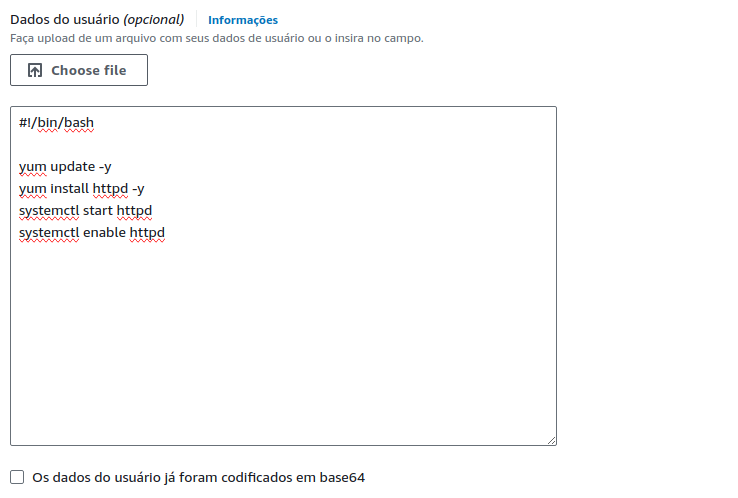

## Iniciando ##

https://docs.aws.amazon.com/

&xrArr; Os serviços AWS são compostos por regiões, zonas de disponibilidade (AZ), e zonas locais. Uma mesma região possui vários data centers, as zonas de disponibilidade, que garantem a disponibilidade dos serviços. Em caso de falha ou manutenção de uma AZ, as demais da mesma região podem suprir a demanda. As zonas locais servem para reduzir a latência entre os data centers e os clientes. 

Alguns serviços não estão disponíveis em todas regiões. 

https://aws.amazon.com/pt/about-aws/global-infrastructure/

### Boas Práticas ###

Ao iniciar uma conta na AWS algumas ações de boas práticas são recomendadas. 

&xrArr; Configurar autenticação de dois fatores (IAM)

&xrArr; Alterar política de senha

&xrArr; Criar uma conta administrativa 

Para a conta administrativa, deve ser criado também um grupo com as permissões de administrador, o qual essa conta pertencerá.

A criação desta conta se faz necessária uma vez que não é uma boa prática utilizar o usuário root.

---

### AWS CLI ###

https://docs.aws.amazon.com/pt_br/cli/latest/userguide/cli-chap-welcome.html

O AWS CLI é o aplicativo de linha de comando para gerenciamento da plataforma através da máquina local. 

&xrArr; Para instalar no Linux (todos comandos devem ser executados na mesma pasta)

Baixar e descompactar o arquivo 

`$ wget https://awscli.amazonaws.com/awscli-exe-linux-x86_64.zip -O awscliv2.zip` 
    
O parâmetro -O indica um nome  personalizado para o arquivo baixado.

`$ unzip awscliv2.zip`

`$ sudo ./aws/install`

&xrArr; É necessário criar um usuário AWS para acesso no CLI (IAM). 

Na criação deste usuário a flag de acesso para o console de gerenciamento deve estar desmarcada e o usuário deve ser incluído em um grupo de acordo com suas necessidades. 

Após a criação é necessário criar uma access key para o usuário, que será utilizada como parâmetro para conexão no AWS CLI

&xrArr; O ambiente utilizado no AWS CLI deve ser configurado via terminal. 

`$ aws configure`

Serão pedidos a access key, a secret access key, a zona (informar a zona indicada no console central) e o formato de saída (sugerido o JSON).

&xrArr; Para máquinas com mais de uma conexão é possível adicionar várias configurações utilizando perfis através do parâmetro profile para a função configure. Caso o parâmetro não seja informado o perfil atribuído será default.

`$ aws configure --profile ´nome´`

&xrArr; Após configurar a conexão pode ser testada.

`$ aws sts get-caller-identity`

Caso a máquina tenha mais de uma conexão pode ser utilizado o parâmetro default, assim como no comando configure.

`$ aws sts get-caller-identity --profile ´nome´`

---

## Amazon Elastic Compute Cloud (Amazon EC2) ##

https://aws.amazon.com/pt/ec2/

&xrArr; As instâncias EC2 são instâncias redimensionáveis de infraestrutura computacional. Funcionam como servidores computacionais. 

São 6 grupos, com diferentes objetivos de desempenho.

### Tipos de instâncias atuais de sexta geração (2024) ###

* Uso geral (Recursos balanceados, carga de RAM e CPU balanceadas e medianas): 

    M6a, M6g, M6gd, M6i, M6id, M6idn, M6in, M7a, M7g, M7gd, M7i, M7i-flex e T4g

* Otimizadas para computação (Maior uso de CPU, foco no processamento de dados): 

    C6a, C6g, C6gd, C6gn, C6i, C6id, C6in, C7a, C7g, C7gd, C7gn, C7i

* Otimizadas para memória (Maior uso de RAM): 
  
    R6a, R6g, R6gd, R6i, R6id, R6idn, R6in, R7a, R7g, R7gd, R7i, R7iz, X2gd, X2idn, X2iedn

* Otimizadas para armazenamento (Uso para bases de dados): 

    I4g, I4i, Im4gn, Is4gen

* Computação acelerada: 
    DL2q, G5g, Inf2, P5, Trn1, Trn1n

* Computação de alta performance: 
    Hpc6a, Hpc6id, Hpc7a, Hpc7g

https://docs.aws.amazon.com/pt_br/AWSEC2/latest/UserGuide/instance-types.html

&xrArr; No console web é possível ver todos os tipos e suas características, bem como filtrar de acordo com o desejado.

Serviços &rarr;  Computação &rarr; EC2 &rarr;  Instâncias &rarr; Tipos de instâncias

---

### Modalidades de contrato ###

&xrArr; O contrato por instâncias EC2 podem ser de 3 tipos.

_O armazenamento é sempre cobrado a parte, inclusive quando não está ocorrendo uso._

* On-Demand (padrão, todos cálculos de economia são feitos usando este método como base):

    Cobrado apenas o uso, ou seja, caso a máquina esteja desligada, não ocorrerão cobranças. A cobrança é feita por hora. Cada hora parcial é cobrada por segundo (a partir de 60 em máquinas linux) ou a hora completa para as demais.

* Reservadas:

    Pode ser feita de 3 formas, Padrão, que não permite alteração e possibilita até 72% de economia, Conversíveis, que permite alterações e até 54% de economia e Programadas, que permite realizar reservas por um curto de período de tempo. 

    Pagamento NoUpfront (sem pagamento no início de uso, faturamento mensal), Partitial Upfront (parte do pagamento no início) e Full Upfront (Pagamento total no início). 

    Contrato de 1 a 3 anos e não cancelável. A cobrança é feita independente do uso.

* Spot:

    Descontos de até 90%, porém pode ser interrompida a qualquer momento. A AWS informa 2 minutos antes da interrupção. Recomendada para aplicações tolerante a falhas, ambientes de testes e outros. Na contratação o valor máximo para pagamento pode ser definido e podem ser definidas instâncias por determinadas cargas de trabalho.

Calculadora de custos: https://calculator.aws/#/

* Savings Plan:

    Além dos faturamentos indicados, o Savings Plan é um modelo de preços flexíveis que oferece preços até 72% mais baixos em troca de um compromisso mensal de uso mínimo específico por um período de 1 a 3 anos. 

    Atende o serviço EC2 individualmente ou em com conjunto com o AWS Fargate e AWS Lambda (pacote Compute Savings Plan) e individualmente o serviço Amazon SageMaker (pacote Machine Learning Savings Plan). 

    Para usar é necessário habilitar o serviço Cost Explorer, um serviço que monitora e faz previsões de gastos, indicando formas otimizadas de uso dos serviços. Para seu funcionamento é necessário atentar que ele precisa de uma base para cálculo, portanto, o uso dos serviços já precisa ocorrer há um tempo. 

    Com o aumento da utilização, é possível contratar Planos de Poupança adicionais, aumentando o recurso disponível. 

    Os planos Compute e EC2 Instance se aplicam a instâncias que fazem parte dos clusters da Amazon EMR, EKS e ECS, porém cobrem apenas as instâncias EC2 são cobertas pelo plano.

---

### Iniciando uma instância ###

&xrArr; A inicialização de uma instância pode ser feita no console web. Serviços &rarr; EC2 &rarr; Instâncias &rarr; Instâncias &rarr; Executar instâncias.

&xrArr; É necessário selecionar uma imagem da AWS (AMI) para a máquina, o tipo de instância, criar um par de chaves (login, que deve ser baixado e armazenado para acesso), gerenciar informações de rede e armazenamento dentre outros. 

&xrArr; Este processo também pode ser feito via terminal.

`$ aws ec2 run-instances --image-id ami-xxxx --count 1 --instance-type 'tipo_instancia' --key-name 'nome_par_chave' --security-group-ids sg-xxxx --subnet-id subnet-xxxx`

Os valores de security-group-ids e subnet-id podem ser encontrados respectivamente em EC2 &rarr; Rede e Segurança &rarr; Grupos de Segurança e VPC &rarr; Nuvem Privada Virtual &rarr; Sub-redes.

&xrArr; Para acessar a instância é necessário utilizar o endereço público da máquina e adicionar o agente ssh (utilizando o arquivo de par de chaves baixado anteriormente). É necessário alterar a permissão do arquivo para privada, uma vez que sem esse procedimento todos acessos e usuários da máquina possuem permissão para o arquivo. O usuário a ser utilizado para acessar a máquina é o usuário ec2-user

`$ sudo chmod 400 'arquivo_chave_par'`

&xrArr; Após a alteração das permissões do arquivo, é possível se conectar a instância via terminal de uma máquina local.

`$ ssh -i 'arquivo_chave_par' ec2-user@ip_publico`

Após a criação é possível nomear a instância.

`$ aws ec2 create-tags --resources 'id_instancia' --tags Key=Name,Value=´nome´`

&xrArr; Para listar as instâncias:

`aws ec2 describe-instances`

---

### Desligamento e Encerramento - Shutdown Behavior, Stop Protection e Terminate Protection ###

&xrArr; Ao finalizar o uso de uma máquina criada ela pode ser interrompida ou encerrada. A máquina encerrada não pode ser utilizada novamente e tem os dados excluídos. Já a máquina interrompida pode ser reiniciada.

&xrArr; Na configuração de uma máquina é possível editar o comportamento no desligamento da máquina com a opção Shutdown Behavior, que define se a máquina irá interromper (stop) ou encerrar (terminate). 

&xrArr; Também é possível habilitar a proteção contra interrupção (Stop Protection), assim não é possível desligar a máquina no terminal. 

&xrArr; Outra proteção existente é a proteção contra encerramento (Termination Protection). 

&xrArr; Todas configurações podem ser feitas na criação da máquina e editadas na janela de ações da máquina. 

&xrArr; Os três recursos atuam no console web, porém caso a máquina esteja com o comportamento de encerrar no desligamento, ao desligar a máquina no terminal de uma máquina ligada a máquina virtual, a máquina ira encerrar e não poderá ser utilizada novamente. Portanto é ideal marcar a proteção contra encerramento e deixar o comportamento no desligamento como interromper. 

&xrArr; É possível remover instâncias via AWS CLI.

`$ aws ec2 terminate-instances --instance-ids 'id_instancia'`

&xrArr; **Para encerrar uma instância é necessário que a proteção contra encerramento e contra interrupção (desligamento) estejam desativadas.**

&xrArr; As operações de alterar proteção contra encerramento e interrupção podem ser feita via terminal. 

* Ativar proteção contra interrupção 
 
  `aws ec2 modify-instance-attribute --instance-id i-xxxxxxxxx --disable-api-stop`

* Desativar proteção contra interrupção 
  
  `aws ec2 modify-instance-attribute --instance-id i-xxxxxxxxx --no-disable-api-stop`

* Ativar proteção contra encerramento 
  
  `aws ec2 modify-instance-attribute --instance-id i-xxxxxxxxx --disable-api-termination `

* Desativar proteção contra encerramento 
  
  `aws ec2 modify-instance-attribute --instance-id i-xxxxxxxxx --no-disable-api-termination `

---

### AMIs - Criação e compartilhamento ###

&xrArr; Além das imagens de sistemas operacionais já disponibilizadas pela AWS ou disponíveis no Marketplace, também é possível criar imagem de uma máquina feita pelo usuário. 

&xrArr; O processo é feito com a criação de uma instância normal, porém como já se espera que alguns recursos da máquina estejam pré-configurados de acordo com a personalização do usuário, podem ser inseridos comandos para inicialização da máquina através do campo Dados do Usuário no item de Detalhes Avançados. 

Os comandos acima indicam o terminal bash para executar os códigos que realizam a atualização do sistema e instalam e executam o servidor |Apache (httpd). Para funcionamento é necessário que o Grupo de Segurança esteja configurado para HTTP na Regra de Entrada através da porta 80. (EC2 &rarr; Grupos de Segurança). Após início da máquina com o servidor é possível testar digitando o endereço IP em um browser ou acessando a máquina via SSH no terminal e executar comandos para verificar a instalação e execução do serviço (necessário sudo) 

`$ rpm -qa | grep httpd`.

`$ systemctl status httpd`

&xrArr; Uma vez com a máquina criada com a configuração desejada, é possível criar a imagem no menu de ações da instância. Ações &rarr; Imagens e modelos &rarr; Criar imagem. Na tela de criação de imagem existe uma flag de não reinicialização. Máquinas criadas com imagens que reinicializam (flag desmarcada) iniciam mais rápido.

&xrArr; Após a criação é possível visualizar a AMI criada. EC2 &rarr; Imagens &rarr; AMIs.

&xrArr; Ao localizar a AMI e selecioná-la, basta marcar a opção de executar instância dessa imagem. Também é possível informar a imagem desejada no processo comum de instância. 

#### Criação de AMIs com o AWS CLI ####

&xrArr; Também é possível criar AMIs utilizando o AWS CLI

`$ aws ec2 create-image --instance-id "i-xxxxxx" --name "nome_imagem" --description "Descrição"`

No campo instance-id é passado o id da instância que servirá de base para a imagem.

&xrArr; Com a imagem criada, uma instância para aplicação da imagem pode ser criada normalmente, apenas com o id de imagem criado sendo passado como parâmetro.

#### Compartilhamento de AMIs ####

&xrArr; AMIs por padrão são criadas privadas, ou seja, apenas o criador pode utilizar a AMI. Também estão disponíveis apenas na região de criação. É possível compartilhar AMIs entre outras contas e regiões. 

&xrArr; AMIs criptografadas e AMIs com código de produto de cobrança associados, como Windows AMIs também não podem ser copiadas. 

&xrArr; O compartilhamento de AMIs pode ser feito através das ações da instância na opção Editar opções da AMI. Na página aparece o campo de Configurações de compartilhamento da AMI, onde é possível selecionar como público ou privado. Ao selecionar pública, qualquer pessoa pode ter acesso à AMI, já ao manter privada é possível compartilhar para pessoas específicas através da opção Contas compartilhadas.

&xrArr; Para compartilhar entre diferentes regiões é necessário utilizar a opção Copiar AMI. Dentro das opções para este processo, existe um campo de seleção de Região de destino. Ao marcar uma região diferente da região original da AMI, a imagem estará disponível em outra região. É possível selecionar se a imagem será criptografada ou não. Imagens criptografadas não permitem cópias por outros usuários. 

&xrArr; Uma AMI possui um snapshot atrelado a ela que é envolvido no processo de compartilhamento. 

&xrArr; O snapshot da AMI é uma forma a qual é possível criar uma AMI de uma AMI que foi compartilhada criptografada. Ao receber a AMI criptografada, é possível iniciar uma instância utilizando o snapshot e criar uma imagem dessa instância. Os snapshots estão disponíveis em EC2 &rarr; Elastic Block Store &rarr; Snapshots.

### Tags ###

&xrArr; São rótulos atribuídos através de chave:valor.

&xrArr; Tags permitem caracterizar os recursos de diferente formas, por exemplo ambiente, proprietários e outros. É muito utilizado em recursos em massa. 

&xrArr; Ao criar uma nova tag com uma chave já existente, o novo valor subistiuirá o antigo. Por exemplo se um recurso tem uma tag "tipo" com valor "vm", se for atribuido a tag "tipo" com o valor "db", o recurso terá apenas uma tag "tipo" e seu valor será "db"

&xrArr; Tags possuem algumas restrições e regras

* Número máximo por recursos de 50
* Em todo recurso cada tag deve ser exclusiva
* Comprimento máximo de 128 caracteres (UTF-8) por chave
* Valor máximo da chave de 256 caracteres (UTF-8)
* Case sensitive
* **O prefixo "aws:" é reservado para uso pela AWS. Não é possível editar ou excluir essa chave e seu valor.**

&xrArr; Tags podem ser criadas na criação de uma instancia ou através da aba de tags de uma instância já existente. Nesta aba também é possível gerenciar tags já existentes. 

### Elastic Block Store (EBS) ###

&xrArr; O EBS é um serviço de armazenamento em blocos de alta performance projetado para o uso juntamente com instâncias EC2. Pode ser colocado como o disco virtual de máquinas virtuais EC2.

&xrArr; Volumes EBS não são globais e devem estar na mesma zona de disponibilidade da instância que está vinculado. 

&xrArr; Volumes EBS, por funcionarem como um disco virtual em uma instância, semelhante a um disco rígido em uma instância, permitem que:

* mais de um esteja atrelado a uma instância;
* um mesmo volume seja reaproveitado em outras instâncias;

&xrArr; Também existem benefícios:

* Disponibilidade de dados: ao criar um EBS ele é automaticamente replicado dentro da zona de disponibilidade.
* Persistência de dados: um volume EBS é armazenado a parte da instância e por isso é possível manter seus dados armazenados após o fim da instância. Cabe lembrar que como o armazenamento reserva um espaço constantemente, independente do uso ou não da instância, enquanto o volume está registrado na Amazon, ele é cobrado. 
* Criptografia de dados: é possível criar volumes com criptografia simples com o recurso Criptografia de Amazon EBS.
* Snapshots: é possível criar snapshots de volumes EBS, salvando os dados no volume para o Amazon S3. O Snapshot pode ser armazenado repetidamente em várias zonas de disponibilidade.
* Flexibilidade: os volumes do EBS permitem alterações de configurações reais durante sua produção

#### Tipos de volumes EBS ####

&xrArr; Os tipos de volumes EBS são baseados na característica física do recurso utilizado pela Amazon, sendo estes SSD ou HDD.

1. **Volumes baseados em SSD:** otimizados para cargas de trabalho de transação envolvendo operações de leitura e gravação frequentes com o tamanho pequeno de entrada e saída, onde o atributo dominante de desempenho é IOPS (Inputs Outputs Per Second)
    1. **SSD-Backed General Purpose (gp2)** SSD's de uso geral
        * Volume SSD de uso geral com equilíbrio de preço e desempenho para uma ampla variedade de cargas de trabalho.
        * Baixa latência (ms).
        * Tamanhos entre 1 GB e 16 TB.
        * Mínimo de 100 e máximo de 3.000 IOPS.
        * Base de 3 IOPS por GB (por exemplo para um disco de 50 GB, será atribuído um valor de 150 IOPS).    
    2. **SSD-Backed General Purpose (gp3)** SSD's de uso geral (seleção padrão da AWS)
        * Volume SSD de uso geral com equilíbrio de preço e desempenho para uma ampla variedade de cargas de trabalho, otimizado em relação ao gp2.
        * Baixa latência (ms).
        * Tamanhos entre 1 GB e 16 TB.
        * Mínimo de 3.000 e máximo de 16.000 IOPS.
        * Razão máxima de IOPS provisionados para o tamanho é de 500:1 (Ou seja, para um disco de 10 GB o máximo de IOPS é de 5.000).
    3. **SSD-Backed Provisioned IOPS (io1)** SSD's com melhorias para taxas mais altas de IOPS
        * Volume de SSD de alto desempenho para cargas de trabalho de missão crítica de baixa latência ou alto desempenho.
        * Possui tamanho mínimo de 4 GB e máximo de 16 TB.
        * Mínimo de 100 e mÁximo de 64.000 IOPS.
        * Razão máxima de IOPS provisionados para o tamanho é de 50:1 (Ou seja, para um disco de 100 GB o máximo de IOPS é de 5.000). A quantidade é inserida manualmente.
    4. **SSD-Backed Provisioned IOPS (io2)** SSD's com melhorias para taxas mais altas de IOPS
        * Volume de SSD de alto desempenho para cargas de trabalho de missão crítica de baixa latência ou alto desempenho, otimizado em relação ao io1.
        * Possui tamanho mínimo de 4 GB e máximo de 64 TB.
        * Mínimo de 100 e máximo de 256.000 IOPS. 
        * Razão máxima de IOPS provisionados para o tamanho é de 1.000:1 (Ou seja, para um disco de 10 GB o máximo de IOPS é de 10.000). 

2. **Volumes baseados em HDD:** otimizados para grandes cargas de trabalho de streaming de dados nas quais as taxas de transferências (medidas em MiB/s) é uma medida de desempenho melhor que IOPS
    1. **Throughput otimizado (st1)** HDD's de uso geral para armazenamento
        * Volume HDD de baixo custo projetado para cargas de trabalho acessadas com frequência e com altas taxas de transferência.
        * Possui tamanho mínimo de 500 GB e máximo de 16 TB.
        * Máximo de 500 IOPS.
    2. **Cold HDD (sc1)** HDD's para armazenamento de dados com pouco acesso (Disco Frio)
        * Volume de HDD com o menor custo projetado para cargas de trabalho acessadas com menor frequência.
        * Possui tamanho mínimo de 500 GB e máximo de 16 TB.
        * Máximo de 250 IOPS.
   * **Ambos tipos de discos não podem ser configurados como um disco para sistema**

#### Criação, modificação e vinculação de volumes EBS ####

&xrArr; A criação de volumes EBS pode ser feita na criação de instâncias ou na área do EBS. 

&xrArr; O procedimento de criar uma instância (Serviços &rarr; EC2 &rarr; Instâncias &rarr; Instâncias &rarr; Executar instâncias) possui uma aba de armazenamento onde é possível criar volumes e adicionar volumes já existentes. Para a raiz do sistema a criação de um novo disco é obrigatória. Caso seja necessário utilizar configurações de disco já predefinidas, é possível selecionar uma imagem para ser clonada nesse disco. Apenas discos do tipo SSD podem ser usados na raiz. Além da raiz, também podem ser criados ou adicionados outros discos (que já podem ser de tipo HDD). Neste momento também pode ser selecionada a opção de excluir ou não o disco (por padrão vem marcado 'Sim').

&xrArr; Criar o volume separadamente da instância pode ser feito em Serviços &rarr; EC2 &rarr; Elastic Block Store &rarr; Volumes &rarr; Criar Volume. Ao criar o volume é necessário inserir as configurações necessárias de cada tipo de volume e se o volume deve ser criptografado e também é possível criar o volume com base em uma imagem já existente. 

&xrArr; Na aba de volumes (Serviços &rarr; EC2 &rarr; Elastic Block Store &rarr; Volumes) é possível ver os volumes já existentes, suas características e usos. Ao selecionar um volume individualmente é possível, além de monitoramento mais detalhado, modificar suas configurações.

&xrArr; Adicionar volumes já existentes em um disco pode ser feito na aba de volumes ao selecionar o volume individualmente.

&xrArr; Todos os processos também podem ser feitos via AWS cli. 

&xrArr; O comando a seguir permite criar um novo volume.

`$ aws ec2 create-volume --volume-type "tipo-do-volume" --size "tamanho-do-volume" --availability-zone "zona-para-criação"`

&xrArr; Também é possível vincular um volume via cli.

`$ aws ec2 attach-volume --volume-id vol-xxxxxxxxxx --instance-id i-xxxxxxxxxx --device 'ponto para montagem do volume'`

O parâmetro device deve iniciar com `sd` ou `xvd`, seguidos de alguma letra por convenção de nomenclatura de disco.

#### Exclusão de volumes EBS ####

&xrArr; Para excluir um volume primeiro o mesmo deve ser desvinculado da máquina. **Inicialmente deve ser avaliado se o volume está em uso no sistema.** O processo de desvincular pode ser feito via console web na aba de volumes (Serviços &rarr; EC2 &rarr; Elastic Block Store &rarr; Volumes). Na aba de Ações aparece a opção de desassociar volume. 

&xrArr; Também pode ser feito via terminal.

`aws ec2 detach-volume --volume-id vol-xxxxxxxxxxx`

&xrArr; Para a exclusão de um volume, o processo pode ser feito através do mesmo caminho para o processo de desassociação pelo console web (Serviços &rarr; EC2 &rarr; Elastic Block Store &rarr; Volumes). Ao selecionar um volume é mostrada uma opção de Excluir.

&xrArr; Também pode ser feito via terminal.

`aws ec2 detach-volume --volume-id vol-xxxxxxxxxxx`

### Snapshots ###

&xrArr; Snapshots são capturas das informações de um volume em determinado momento. Funcionam armazenando os dados do volume no momento de criação do snapshot em um Bucket S3. Em novos snapshots desse volume o processo é feito de maneira recursiva, ou seja, são armazenadas apenas as alterações em relação ao snapshot anterior. 

